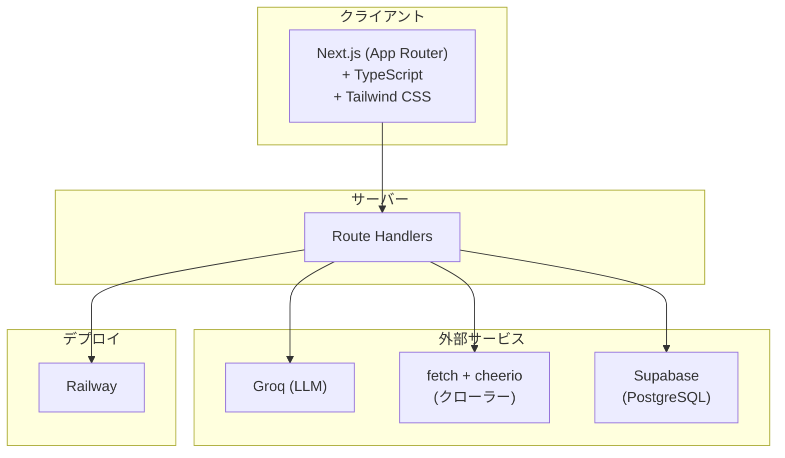
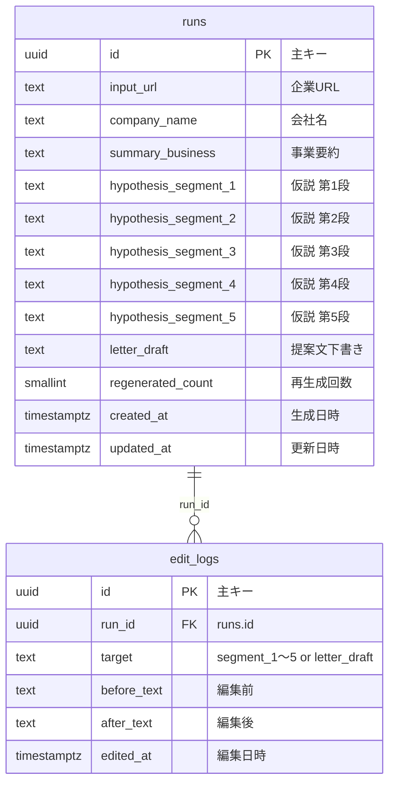

# HypoFrame（営業思考フレームワーク実装ツール）

中小企業向け受託営業で**営業仮説の構造化**を行うWebツールです。「仮説を書くAI」ではなく、**仮説を構造化するフレームワークを動かすツール**として設計しています。

### プロジェクト工程
- **開発開始日**: 2026/2/23

---

## 目的 & 開発背景

営業活動における大きな非効率は、企業理解と仮説構築が**属人化している**ことです。多くの営業は、企業情報の収集に時間がかかり、仮説の作り方が体系化されておらず、提案文を毎回ゼロから書いています。

そこで、AIで文章を量産するのではなく、**営業の思考プロセス自体を構造化する**方向を選びました。AI文章生成ツール・企業検索ツール・経営課題分析ツールといったポジションは採用せず、**営業思考フレームワーク実装ツール**として定義しています。理由は、文章生成市場は競合が多く差別化が難しく価格競争に陥りやすい一方で、「営業の思考を構造化する」領域はまだ明確な競合が少ないためです。生成物ではなく、思考プロセスそのものを価値として提供する方が一貫性がある、という判断です。

また、最初に狙う市場は**中小向け受託営業**にしています。大企業向けは導入障壁が高く意思決定も遅いため MVP 検証に向かず、受託営業は提案文作成頻度が高く属人化しやすく標準化ニーズがあるため、検証スピードを重視してこの市場から始めます。設計は、プロダクトを広く売り込むフェーズではなく、**既存案件対応**として行う前提です。予算はできるだけ無料で実装し、日本企業向け・受託販売を想定しています。

コアバリューは、企業ごとの営業仮説（hypothesis）と提案文下書き（letter_draft）を生成することです。「企業を探す」「情報を集める」は手段であり、中心価値ではありません。中心価値は**営業仮説の構造化と再現性**です。ブランドは「営業の思考を構造化するツール」、思想は「属人化した営業仮説構築を、再現可能なプロセスへ変える」と定義しています。

ツール設計の原則は二つです。第一に、**仮説の質を標準化するツールである**こと。速さや件数より、仮説の型と質の再現性を優先します。第二に、**とにかく早くするのは避ける**こと。質を損なってまで速度を追求せず、処理時間目標も「質を犠牲にしない範囲での」目安とし、クロールや LLM の設計で中身を削って短時間に寄せるより、やや時間がかかっても仮説の質を守る方を選びます。

---

## ターゲット

中小企業向け受託営業を行う企業。利用者は営業担当者・営業責任者・少人数組織を想定しています。

---

## 機能（MVP）

**必須（7つ）**
- 企業URL入力
- Web情報取得（HPのみ）
- 事業要約生成
- 固定5段の営業仮説生成
- 提案文下書き生成
- 編集
- テキストエクスポート

**対象外（MVPでは行わない）**
- 企業検索
- IR解析
- CRM連携
- メール送信
- スコアリング
- 多言語
- チーム管理

---

## 仮説の構造（固定5段）

1. 企業の現在状況整理  
2. 潜在課題の仮説  
3. 課題の背景要因  
4. 改善機会（介入ポイント）  
5. 提案仮説  

各段は2〜4文程度とし、断定を避け、情報源は HP のみとします。

---

## 技術スタック

- **ランタイム**: Node.js 20+
- **フロント**: Next.js（App Router）+ TypeScript + Tailwind
- **API**: Next.js Route Handlers（同一リポジトリ）
- **LLM**: Groq（無料枠）
- **クロール**: fetch + cheerio（同一サイト2〜3ページ、robots.txt 遵守）
- **DB**: Supabase（PostgreSQL）
- **デプロイ**: Railway

---

## テーブル構造（Supabase）

---

##  commitメッセージ

- feat：新機能追加
- fix：バグ修正
- hotfix：クリティカルなバグ修正
- add：新規（ファイル）機能追加
- update：機能修正（バグではない）
- change：仕様変更
- clean：整理（リファクタリング等）
- disable：無効化（コメントアウト等）
- remove：削除（ファイル）
- upgrade：バージョンアップ
- revert：変更取り消し
- docs：ドキュメント修正（README、コメント等）
- tyle：コードフォーマット修正（インデント、スペース等）
- perf：パフォーマンス改善
- test：テストコード追加・修正
- ci：CI/CD 設定変更（GitHub Actions 等）
- build：ビルド関連変更（依存関係、ビルドツール設定等）
- chore：雑務的変更（ユーザーに直接影響なし）

---

## 関連ドキュメント

| ファイル | 内容 |
|----------|------|
| `docs/01-requirements.md` | 要件定義 |
| `docs/02-product-strategy.md` | プロダクト戦略 |
| `docs/03-system.md` | システム定義 |
| `docs/04-implementation-decisions.md` | 実装方針 |
| `docs/05-ui-ux.md` | UI/UX仕様 |
| `docs/06-decision-log.md` | 意思決定ログ |
| `docs/07-external-requirements.md` | 外部要件 |
| `docs/08-implementation-order.md` | 実装順序と確認 |
| `docs/09-app-design.md` | アプリ設計（DB・API・環境変数） |
